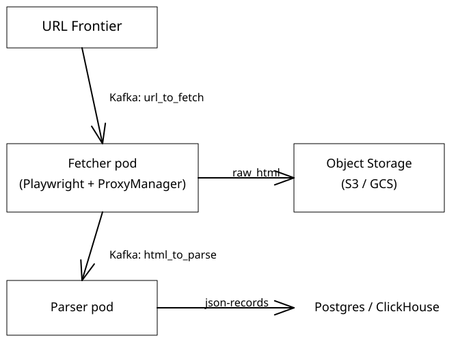

# System Design Diagrams

A collection of Excalidraw diagrams made while studying for system design interviews. Each `.excalidraw` file has a matching `.svg` rendered preview below.

To edit a diagram: open the `.excalidraw` file at [excalidraw.com](https://excalidraw.com) or in VS Code with the Excalidraw extension.
To re-export the SVGs after editing: `npx excalidraw_export --embed_fonts "<file>.excalidraw"`, then rename `.excalidraw.svg` to `.svg`.

## Sources

| Tag | Source |
|-----|--------|
| JHNL | [Jordan Has No Life's YouTube channel](https://www.youtube.com/@jordanhasnolife5163) |
| SDI V2 | Alex Xu's [System Design Interview](https://www.amazon.com/dp/B08CMF2CQF) (vol 1 and 2) |
| SDFC | [System Design Fight Club YouTube channel](https://www.youtube.com/@SDFC) |
| HI | [Hello Interview](https://www.hellointerview.com/learn/system-design/in-a-hurry/introduction) mock interview platform |
| S.G. | Self-generated |

Big thanks to Fabian Hinsenkamp for the [Excalidraw system design symbols](https://bigtechcoach.gumroad.com/l/excalidraw-system-design-symbols) library used in many of these.

## Communication and social

### WhatsApp (JHNL)

### Newsfeed (JHNL)

### Tweet Search (HI)

## Streaming

### Netflix (JHNL)

## Maps and location

### Google Maps (SDI V2)

### Nearby Friends (SDI V2)

### Proximity Service (SDI V2)

## Ticketing and commerce

### Ticketmaster (HI version)

### Ticketmaster (SDFC version)

### Price Tracker (SDFC)

### Donation Drive (self)

## Storage and files

### File Storage (JHNL)

### Mock Google Photos

## URL and cache

### TinyURL (JHNL)

### LRU Cache

## Web scraping

### Coupang Web Scraper

